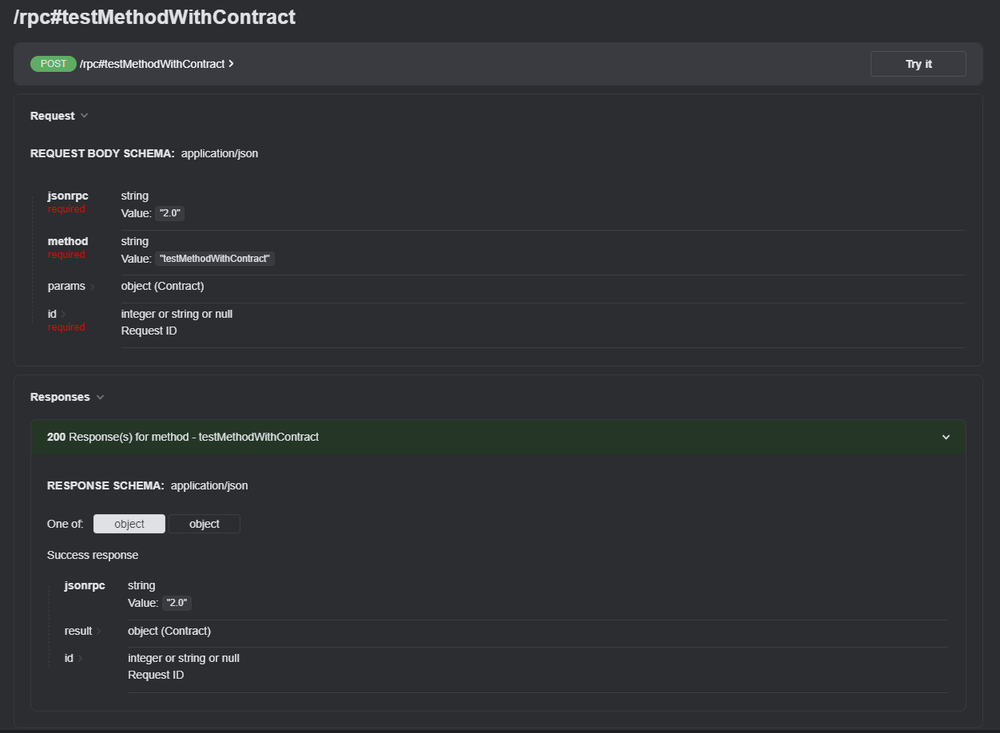

# JSON-RPC Server bundle

This bundle provide an easy way to implement json-rpc server with fully specification supporting.
Bundle supports multiple procedure calls in one request as described in specification.

[JSON-RPC](https://www.jsonrpc.org/specification) specification is fully compatible
with [CQRS](https://en.wikipedia.org/wiki/Command_Query_Responsibility_Segregation) architecture

## Install

```bash
composer require mops1k/json-rpc-bundle
```

Import route declaration in your routes:

```yaml
#config/routes/json-rpc.yaml
app_file:
    # loads routes from the given routing file stored in some bundle
    resource: '@JsonRpcBundle/Resources/config/routing/json-rpc-bundle.yaml'
```

Or add your own paths by template:

```yaml
json_rpc_entrypoint:
    path: '/path/to/rpc'
    methods: 'POST'
    controller: 'JsonRpcBundle\Controller\JsonRpcController'

json_rpc_namespace_entrypoint:
    path: '/path/to/rpc/{namespace}'
    methods: 'POST'
    controller: 'JsonRpcBundle\Controller\JsonRpcController'
```

## Usage

To create method you have to create invokable class with
attribute [`\JsonRpcBundle\Attribute\AsRpcMethod`](./src/Attribute/AsRpcMethod.php), where `methodName` constructor
parameter must contain method name. Example:

```php
<?php

use JsonRpcBundle\Attribute\AsRpcMethod;
use Symfony\Component\Validator\Constraints\Collection;
use Symfony\Component\Validator\Constraints\GreaterThanOrEqual;

#[AsRpcMethod('methodWithoutContract')]
class MethodWithoutContract
{
    public function __invoke(int $id): int
    {
        return $id;
    }
}
```

#### Contract request DTO

Bundle provide possibility to provide params to your DTO class. For these feature you have to add
attribute [`\JsonRpcBundle\Attribute\RpcMethodContract`](./src/Attribute/RpcMethodContract.php).
DTO passed supports validation through [symfony/validator](https://symfony.com/doc/current/validation.html).
Example:

```php
<?php

use JsonRpcBundle\Attribute\AsRpcMethod;
use JsonRpcBundle\Attribute\RpcMethodContract;
use JsonRpcBundle\Tests\Stubs\Contract\Contract;
use Symfony\Component\Validator\Constraints as Assert;

readonly class Contract
{
    public function __construct(
        #[Assert\GreaterThanOrEqual(0)]
        public int $id,
        #[Assert\NotBlank(allowNull: false)]
        public ?string $text = null,
    ) {
    }
}

#[AsRpcMethod('methodWithContract')]
#[RpcMethodContract(Contract::class)]
class MethodWithContract
{
    public function __invoke(Contract $contract): array
    {
        return [
            'id' => $contract->id,
            'text' => $contract->text,
        ];
    }
}
```

#### Validation for method params without contract

If you don't want to use DTO, you still able to validate method parameters and set its groups. In this case you need to
implement your method class
from [`\JsonRpcBundle\MethodResolver\ValidateMethodParametersInterface`](./src/MethodResolver/ValidateMethodParametersInterface.php).
Example:

```php
<?php

use JsonRpcBundle\Attribute\AsRpcMethod;
use JsonRpcBundle\MethodResolver\ValidateMethodParametersInterface;
use Symfony\Component\Validator\Constraints\Collection;
use Symfony\Component\Validator\Constraints\GreaterThanOrEqual;
use Symfony\Component\Validator\Constraints\GroupSequence;

#[AsRpcMethod('methodWithoutContract')]
class MethodWithoutContract implements ValidateMethodParametersInterface
{
    public function __invoke(int $id): int
    {
        return $id;
    }

    public function configureValidation(): Collection
    {
        return new Collection([
            'id' => [
                new GreaterThanOrEqual(0),
            ],
        ], groups: ['rpc']);
    }

    public function validationGroups(): array|string|GroupSequence|null
    {
        return ['rpc'];
    }
}
```

#### Notification

Json rpc supports notification requests what does not return any response. To make your method as notification, just
add `void` in `__invoke` return type hint.
Example:

```php
use JsonRpcBundle\Attribute\AsRpcMethod;

#[AsRpcMethod('updateUser')]
class UpdateUser
{
    public function __invoke(int $id): void
    {
        // some logic
    }
}
```

#### Namespace

Bundle supports method namespacing. To set method namespace, use `\JsonRpcBundle\Attribute\AsRpcMethod::$namespace`
attribute parameter.
Example:

```php
use JsonRpcBundle\Attribute\AsRpcMethod;

#[AsRpcMethod(methodName: 'update', namespace: 'user')]
class UpdateUser
{
    public function __invoke(int $id): void
    {
        // some logic
    }
}
```

To fetch namespaced method you can call it by method name (`namespace.methodName`) or call to path `/rpc/{namespace}`
and use regular method name.
Examples:

1. Call to `/rpc`:
    ```json
    {
      "jsonrpc": "2.0",
      "method": "user.update",
      "params": null,
      "id": 32
    }
    ```
2. Call to `/rpc/user`:
    ```json
    {
      "jsonrpc": "2.0",
      "method": "update",
      "params": null,
      "id": 32
    }
    ```

> This feature also supports bath requests.

## API Documentation



Bundle supports documentation semi-auto generation
thru [nelmio/api-doc-bundle](https://github.com/nelmio/NelmioApiDocBundle).
By default documentation generate params from method parameters, method contract. If you need more specific params
documentation,
just use `OA\Property` attribute. If you need specific response result, then
use `\JsonRpcBundle\ApiDoc\Attribute\Result`
attribute (set array of `OA\Property` inside `$properties` parameter).
Object responses auto-generated to documentation by it's describing inside class.
